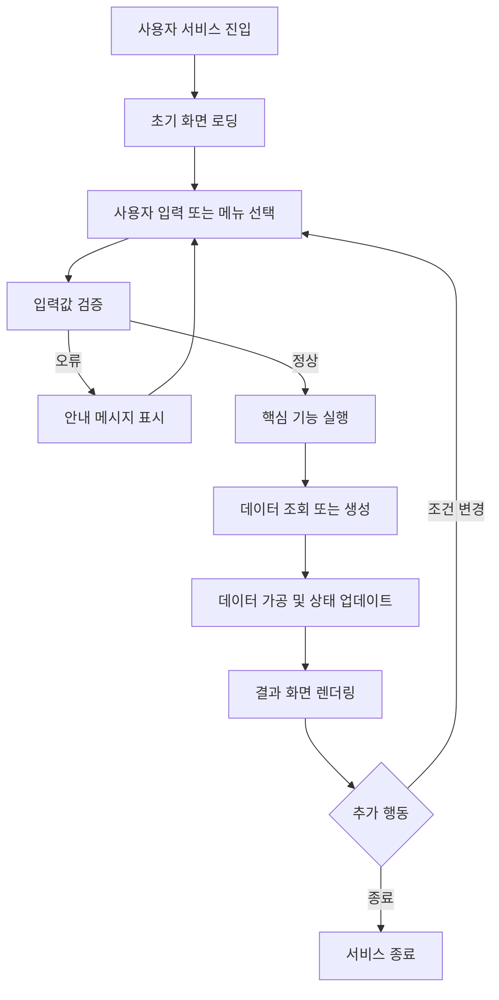
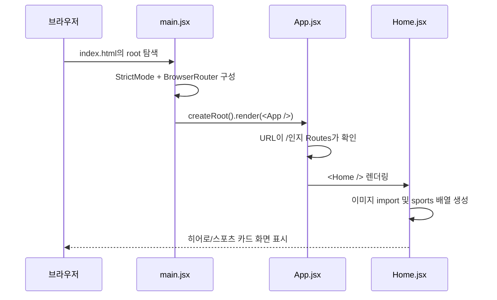

# SPORTORY 코드 진행 스토리보드

> 목적: 발표용 요약이 아니라, 프로젝트의 동작 원리와 코드 진행 과정을 장기 보관하기 위한 문서
>
> 상태: 1차 구조 초안 — 실제 파일명과 함수명을 확인한 뒤 장면별로 보완

## 0. 전체 흐름

## 1. 장면별 스토리보드

### Scene 01 — 서비스 진입

- 사용자 행동: SPORTORY 서비스에 접속한다.
- 화면 상태: 첫 화면 또는 기본 페이지가 표시된다.
- 코드 역할: 브라우저의 `root` DOM에 React 애플리케이션을 마운트하고 라우팅을 활성화한다.
- 실제 파일: `frontend/src/main.jsx`
- 진행 순서:
  1. `StrictMode`로 React 개발 단계 검사를 활성화한다.
  2. `BrowserRouter`가 URL 기반 화면 이동을 담당하도록 `App`을 감싼다.
  3. `document.getElementById('root')`로 `frontend/index.html`의 React 마운트 지점을 찾는다.
  4. `createRoot(...).render(...)`가 `<App />`을 브라우저 화면에 그린다.
- 입력: 브라우저 실행 및 `index.html`의 `root` 요소
- 출력: React 앱 실행, URL 라우팅 가능한 화면
- 다음 호출: `frontend/src/App.jsx`의 `App()`
- 보관 포인트: 실제 서비스 화면은 `main.jsx`에서 직접 만들지 않고, `App.jsx`로 진입시킨다.

#### 서술형 기록

사용자가 SPORTORY 프론트엔드를 실행하면 가장 먼저 `frontend/src/main.jsx`가 실행된다. 이 파일은 화면 자체를 만드는 파일이라기보다 React 애플리케이션을 브라우저에 연결하는 시작점이다. 먼저 `index.html` 안에 있는 `root`라는 HTML 요소를 찾고, `createRoot`를 이용해 React가 해당 영역을 관리하도록 만든다.

그 다음 전체 애플리케이션을 `StrictMode`와 `BrowserRouter`로 감싼다. `StrictMode`는 개발 중 잠재적인 문제를 확인하는 역할을 하고, `BrowserRouter`는 URL에 따라 서로 다른 화면을 보여줄 수 있도록 라우팅 기능을 제공한다. 마지막으로 `<App />`을 렌더링하면서 `frontend/src/App.jsx`로 제어가 넘어간다.

즉, Scene 1의 핵심은 사용자가 특정 기능을 누르기 전에 React 앱과 라우팅 환경을 먼저 준비하는 것이다. 이 단계에서 아직 선수 데이터나 상세 정보가 조회되지는 않는다.

### Scene 02 — 초기 데이터 준비

- 사용자 행동: 화면이 로딩되기를 기다린다.
- 화면 상태: 기본 데이터, 메뉴, 공통 UI가 준비된다.
- 코드 역할: 현재 홈 화면은 API를 호출해 초기 데이터를 받는 방식이 아니라, 정적 이미지와 스포츠 목록을 컴포넌트 내부에서 준비한다.
- 실제 파일: `frontend/src/pages/Home/Home.jsx`
- 진행 순서:
  1. `Home` 컴포넌트가 실행된다.
  2. `home_hero.png`와 스포츠별 이미지 6개를 import한다.
  3. `useRef(null)`로 스포츠 카드 가로 스크롤 영역을 참조한다.
  4. `sports` 배열에 종목명, 상태, 이미지, 이동 가능 여부를 정의한다.
  5. `sports.map(...)`이 배열을 순회하며 스포츠 카드를 만든다.
  6. `available: true`인 Tennis만 `Link`를 통해 `/tennis/players`로 이동할 수 있게 한다.
  7. 나머지 종목은 `Planned` 상태의 일반 `div`로 표시된다.
- 입력: import된 이미지 자산과 컴포넌트 내부의 `sports` 배열
- 출력: 히어로 이미지, 스포츠 탐색 카드, Tennis 상세 진입 링크
- 데이터 성격: Scene 02의 홈 탐색 데이터는 현재 정적 데이터이며, 선수 목록·상세 정보는 이후 화면에서 백엔드 API와 연결되는 구조다.
- 보관 포인트: 홈 화면의 `Explore sports` 버튼은 `scrollIntoView`로 `#explore-sports` 위치까지 부드럽게 이동하고, 좌우 버튼은 `railRef.current?.scrollBy(...)`로 카드 레일을 움직인다.

#### 서술형 기록

`App.jsx`는 현재 브라우저 주소가 `/`인지 확인한 뒤 `Home` 컴포넌트를 화면에 표시한다. `Home` 컴포넌트가 실행되면 먼저 홈 화면을 구성하는 이미지 파일들을 불러온다. 대표 이미지인 `home_hero.png`와 Tennis, Football, Basketball, Baseball, Cycling, Running에 해당하는 스포츠 이미지를 각각 import한다.

이후 컴포넌트 내부에서 `sports` 배열을 만든다. 이 배열에는 각 스포츠의 이름, 화면에 표시할 상태, 이미지, 실제로 이동할 수 있는지 여부가 들어 있다. 현재 Tennis만 `available: true`로 설정되어 있고, 나머지 스포츠는 아직 개발 예정이라는 의미의 `Planned` 상태를 가진다.

화면이 그려질 때 `sports.map(...)`이 배열을 순서대로 읽으며 스포츠 카드를 만든다. Tennis 카드의 경우 `Link` 컴포넌트로 감싸져 있기 때문에 클릭하면 `/tennis/players` 주소로 이동한다. 반면 나머지 카드는 일반 `div`로 만들어져 화면에 표시만 되고 이동 기능은 제공하지 않는다.

홈 화면의 버튼 동작도 이 단계에서 준비된다. `Explore sports` 버튼은 `scrollIntoView`를 호출해 사용자를 스포츠 탐색 영역으로 부드럽게 이동시킨다. 좌우 화살표 버튼은 `useRef`로 저장한 스포츠 카드 영역에 `scrollBy`를 실행해 카드 목록을 가로로 이동시킨다.

따라서 현재 Scene 2는 서버에서 데이터를 받아오는 단계라기보다, 홈 화면에 필요한 정적 이미지와 스포츠 목록을 준비하고 화면에 배치하는 단계다. 실제 선수 목록과 선수 상세 정보는 홈 화면에서 Tennis를 클릭해 `/tennis/players`로 이동한 뒤 백엔드 API와 연결된다.

#### Scene 01 → Scene 02 호출 흐름

### Scene 03 — 사용자 입력

- 사용자 행동: 검색, 선택, 버튼 클릭 또는 조건 입력을 수행한다.
- 화면 상태: 입력값이 UI 상태에 저장된다.
- 코드 역할: 이벤트를 감지하고 입력값을 다음 처리 단계로 전달한다.
- 확인할 파일/함수: `[UI 파일]`, `[이벤트 핸들러]`
- 입력: 사용자 입력값
- 출력: 처리 요청 또는 상태 변경
- 기록할 내용: 입력 항목, 필수값, 기본값, 입력 제한

### Scene 04 — 입력 검증

- 사용자 행동: 실행 버튼을 누른다.
- 화면 상태: 정상 입력이면 다음 단계로 이동하고, 오류면 안내 메시지가 표시된다.
- 코드 역할: 빈 값, 잘못된 형식, 허용 범위를 검사한다.
- 확인할 파일/함수: `[검증 파일]`, `[validation 함수]`
- 입력: 사용자 입력값
- 출력: 통과/실패 결과
- 기록할 내용: 검증 조건, 오류 메시지, 예외 처리 방식

### Scene 05 — 핵심 기능 실행

- 사용자 행동: 시스템이 요청을 처리하는 동안 결과를 기다린다.
- 화면 상태: 로딩 또는 처리 중 상태가 표시될 수 있다.
- 코드 역할: SPORTORY의 핵심 문제를 해결하는 로직을 실행한다.
- 확인할 파일/함수: `[핵심 로직 파일]`, `[핵심 함수]`
- 입력: 검증된 입력값과 필요한 데이터
- 출력: 계산/검색/추천/분석 결과
- 기록할 내용: 핵심 알고리즘, 주요 조건문, 함수 호출 순서

### Scene 06 — 데이터 가공

- 사용자 행동: 처리 결과를 기다린다.
- 화면 상태: 원본 데이터가 서비스에 맞는 형태로 변환된다.
- 코드 역할: 필터링, 정렬, 변환, 집계 또는 매핑을 수행한다.
- 확인할 파일/함수: `[가공 파일]`, `[transform 함수]`
- 입력: 원본 데이터 또는 API 응답
- 출력: 화면 표시용 데이터
- 기록할 내용: 데이터 변환 전/후 구조, 주요 컬럼/필드, 누락값 처리

### Scene 07 — 결과 표시

- 사용자 행동: 결과를 확인한다.
- 화면 상태: 카드, 표, 그래프 또는 상세 화면이 표시된다.
- 코드 역할: 처리된 데이터를 UI 컴포넌트에 연결한다.
- 확인할 파일/함수: `[결과 화면 파일]`, `[render 함수/컴포넌트]`
- 입력: 가공된 결과 데이터
- 출력: 사용자에게 보이는 결과
- 기록할 내용: 결과 표현 방식, 정렬/필터 UI, 빈 결과 처리

### Scene 08 — 재입력 및 예외 흐름

- 사용자 행동: 조건을 바꾸거나 오류 상황을 다시 시도한다.
- 화면 상태: 이전 상태가 유지되거나 초기화된다.
- 코드 역할: 상태를 갱신하고 같은 흐름을 다시 실행한다.
- 확인할 파일/함수: `[상태 관리 파일]`, `[reset/retry 함수]`
- 입력: 수정된 조건 또는 재시도 요청
- 출력: 갱신된 결과 또는 오류 안내
- 기록할 내용: 상태 초기화 기준, 재실행 범위, 사용자 안내 방식

## 2. 코드 추적표

| 단계 | 사용자 행동 | 담당 파일 | 핵심 함수/컴포넌트 | 입력 | 출력 | 다음 단계 |
|---|---|---|---|---|---|---|
| 진입 | 서비스 접속 | `[확인 필요]` | `[확인 필요]` | 없음 | 초기 화면 | 데이터 준비 |
| 입력 | 조건 선택/입력 | `[확인 필요]` | `[확인 필요]` | 사용자 값 | 처리 요청 | 검증 |
| 검증 | 실행 버튼 클릭 | `[확인 필요]` | `[확인 필요]` | 입력값 | 통과/오류 | 핵심 기능 |
| 처리 | 시스템 실행 | `[확인 필요]` | `[확인 필요]` | 검증값 | 원시 결과 | 데이터 가공 |
| 출력 | 결과 확인 | `[확인 필요]` | `[확인 필요]` | 가공 데이터 | 결과 화면 | 재입력/종료 |

## 3. 단계별 보완 순서

1. 프로젝트 진입점과 화면 파일을 확인한다.
2. 사용자 입력에서 실행되는 이벤트 핸들러를 추적한다.
3. 핸들러가 호출하는 핵심 함수와 데이터 흐름을 기록한다.
4. 결과가 화면에 표시되는 컴포넌트까지 연결한다.
5. 오류·빈 결과·재시도 흐름을 추가한다.
6. 실제 파일명, 함수명, 코드 위치를 표의 빈칸에 채운다.

## 4. 보관 시 함께 남길 정보

- 실행 방법과 필요한 환경변수
- 사용 기술 및 기술을 선택한 이유
- 데이터 출처와 데이터 형식
- 주요 파일의 책임
- 핵심 함수 호출 순서
- 예외 처리와 알려진 한계
- 향후 개선할 기능

